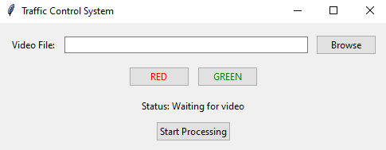
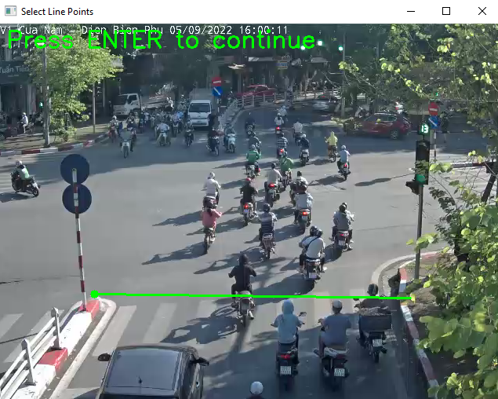
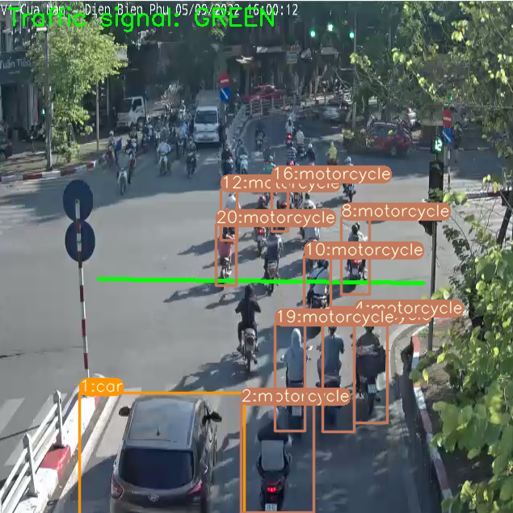

# Detecting, tracking vehicle in intersection
## Dataset
[Roboflow Dataset](https://universe.roboflow.com/machine-learning-class-eiri5/intersection-traffic-piimy)
## Setting
```bash
git clone https://github.com/Lam03tn/TrafficLightViolation.git
```

```bash
cd TrafficLightViolation
```

```bash
pip install -r requirements.txt
```

## Path config
### Model path
```models
...
├──models
|  ├── configs
|  |   ├──yolov5.yaml
|  |   └──yolov8.yaml
|  ├── yolov5.pt
|  ├── yolov8.pt
|  ├── ssd.pt
|  └── fpn-fasterrcnn.pt

```
### Dataset path
```dataset
├──COCO-dataset # For FasterRCNN and SSD
|  ├── train
|  |    ├── ...
|  |    └── _annotations.coco.json
|  ├── valid
|  |    ├── ...
|  |    └──_annotations.coco.json
|  └── test
|       ├── ...
|       └── _annotations.coco.json  
```

```dataset
├──YOLO_Dataset # For YOLO
|  ├── train
|  |   ├── images
|  |   └── labels
|  ├── valid
|  |   ├── images
|  |   └── labels
|  ├── test
|  |   ├── images
|  |   └── labels
|  └── data.yaml
```

## Training
- With FPN-FasterRCNN and SSD, data-path is `coco-root`
- With YOLO model, data-path is `data.yaml`
```bash
# Training models
python train.py --model_name YOLOv5m --num_classes 4 [--save_path models/YOLOv5] --data <data-path> --epochs 10 --batch_size 16 [--configs models/yolov5.pt]
```
Model name == `FPN-FasterRCNN` or `SSD` or `YOLOv5*` or `YOLOv8*` with `*` is one of this `s`,  `l`, `x`
 
## Tracking with line inputs
```bash
# Tracking with line input from user
python tracking_with_line.py --model_name SSD --num_classes 4 --weight models/SSD_model.pt
```

## Interface
### UI



### Draw line from input



### Tracking object


